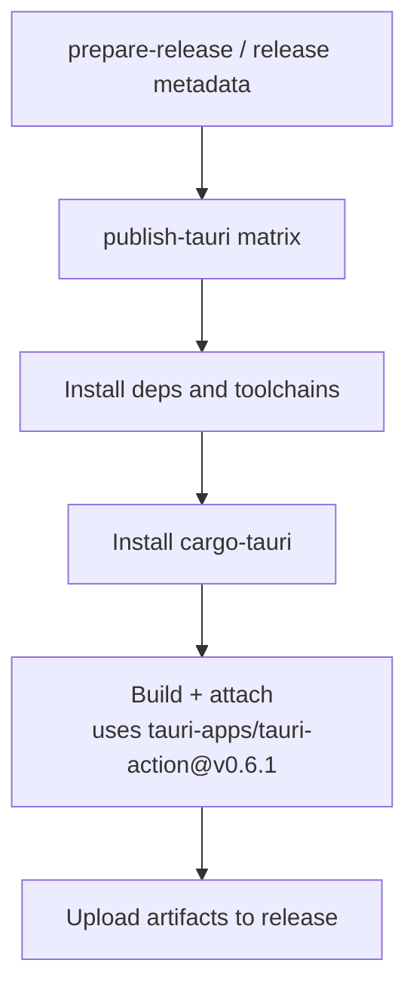
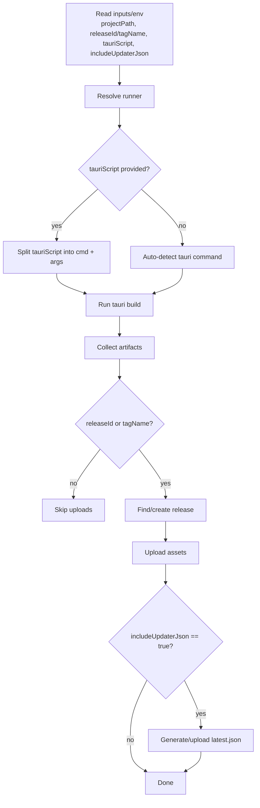
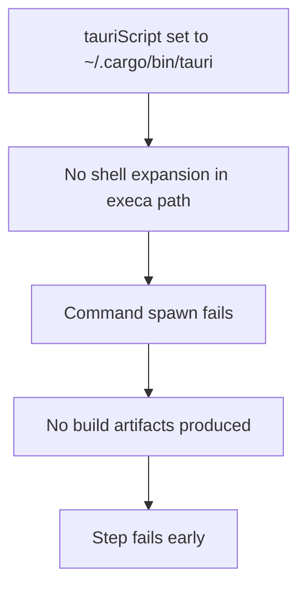
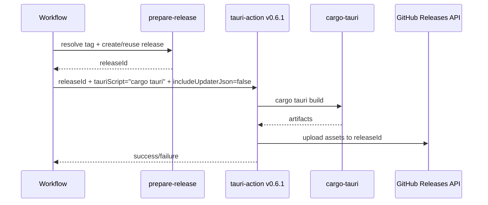

# CI Investigation: `Build + attach to GitHub Release` Failure

Date: 2026-02-07  
Workflow run: `21777192668`  
Job reviewed: `https://github.com/ScottMorris/liminal-notes/actions/runs/21777192668/job/62835570468`

## Scope
Investigate why the publish workflow failed in the `Build + attach` step using `tauri-apps/tauri-action@v0.6.1`, document root cause, and capture implemented follow-up fixes.

## What failed
Both matrix jobs failed at the same step:
- `publish-tauri (ubuntu-24.04, apt-get)`
- `publish-tauri (ubuntu-24.04-arm, apt-get)`

The failing run was triggered by `workflow_dispatch` on branch `main` (not by a `desktop-v*` tag push).

## Key evidence from failing run

### 1. Inputs passed into failing action invocation
From the run log input block:
- `uses: tauri-apps/tauri-action@v0.6.1`
- `uploadUpdaterJson: false` (invalid key for this action version)
- `tauriScript: ~/.cargo/bin/tauri`

### 2. Installed CLI binary did not match configured command
The prior install step produced `cargo-tauri` (not `tauri`).

### 3. Step exited immediately before real build output
Logs showed:
- `running ~/.cargo/bin/tauri [ 'build' ]`
- followed by unsettled top-level-await warning from action bundle
- no normal Tauri build logs after that point

### 4. Upstream action code path
`tauri-action@v0.6.1`:
- Splits `tauriScript` and executes it directly.
- Uses `execa(command, args, ...)` without shell expansion.
- Therefore `~` in command path is not expanded.

## Root cause (high confidence)
The action was configured to execute an invalid command path/name combination:
1. `~/.cargo/bin/tauri` is not shell-expanded in this code path.
2. The installed binary in the job was `cargo-tauri`.

That produced command execution failure before build/upload logic could proceed.

## Secondary finding
`uploadUpdaterJson` was invalid for `tauri-action@v0.6.1`; the valid input is `includeUpdaterJson`.

## Mermaid diagrams

### Workflow placement

### `tauri-action@v0.6.1` internal flow

### Failure path (original)

### Current path (after fixes)

## Fixes implemented

### Initial correctness fixes
- Replaced invalid input key with `includeUpdaterJson`.
- Replaced failing command path with `tauriScript: "cargo tauri"`.

### Workflow hardening
- Added `prepare-release` job to resolve/create/reuse a single release and provide `releaseId` to matrix builds.
- Added `workflow_dispatch` inputs for explicit release tag and release draft mode.
- Added release tag validation (`desktop-v*`).
- Added workflow concurrency keyed by event/tag.
- Kept action refs on version tags by contributor preference.

### Version source-of-truth updates
- `pnpm` sourced from `package.json` `packageManager`.
- Node version sourced from `.node-version` via `node-version-file` in workflows.
- Rust toolchain sourced from `rust-toolchain.toml`.
- Added `engines` in `package.json`.

## Current release posture
- Regular releases are the default behaviour.
- Manual dispatch can opt into draft mode.
- `includeUpdaterJson` remains `false` until updater signing/verification and in-app upgrade behaviour are implemented.

## Source references used
- `.github/workflows/publish-desktop.yml`
- `.github/workflows/publish-site.yml`
- `package.json`
- `.node-version`
- `rust-toolchain.toml`
- Run logs (jobs `62835570468`, `62835570471`)
- Upstream action source for `tauri-apps/tauri-action@v0.6.1` (`action.yml`, runner/build/utils implementation)
